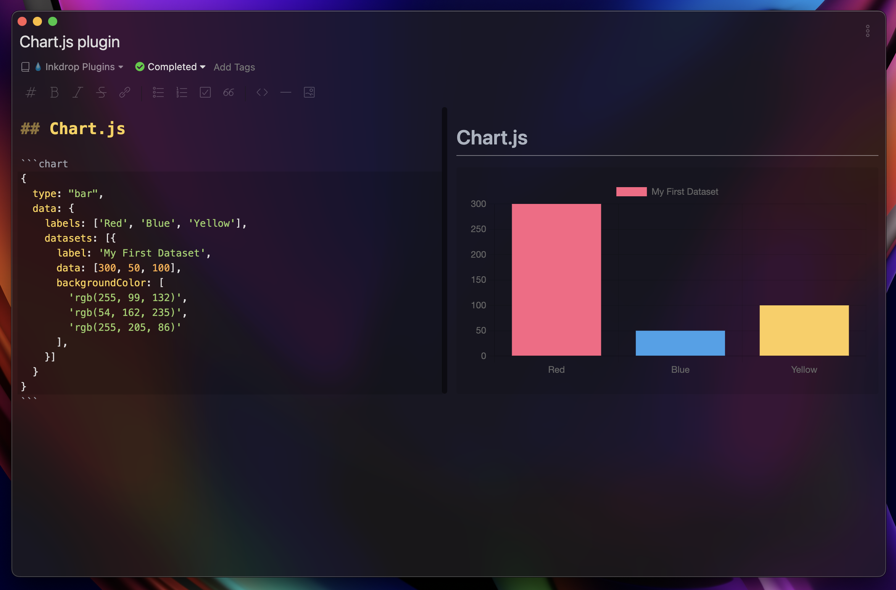

# Chart.js


Inkdrop plugin for drawing charts with [Chart.js](https://www.chartjs.org/)



## Install

```
ipm install chartjs
```

## Usage

Following the [Chart.js usage](https://www.chartjs.org/docs/latest/getting-started/usage.html), write a JSON config to be passed into `Chart(ctx, config)` object as a second argument.

**NOTE**

Since the version 1.1.0, this plugin allows [Relaxed-JSON](http://oleg.fi/relaxed-json) instead of a strict vanilla JSON format. You can write a config the same way as a JavaScript object format.

**Example**

````
```chart
{
    type: 'pie', 
    data: {
        labels: ['Foo', 'Bar', 'Baz'],
        datasets: [{
            data: [40, 32, 22],
            backgroundColor: [
                '#FF6384',
                '#36A2EB',
                '#FFCE56',
            ]
        }]
    }
}
```
````

This will be rendered as


Also you can write in a strict JSON format as follows

````
```chart
{
    "type": "pie", 
    "data": {
        "labels": ["Foo", "Bar", "Baz"],
        "datasets: [{
            "data": [40, 32, 22],
            "backgroundColor": [
                "#FF6384",
                "#36A2EB",
                "#FFCE56"
            ]
        }]
    }
}
```
````

## CHANGELOG

- 1.3.0
  - re-render responsively when the preview pane is resized

- 1.2.0
  - JSON syntax highlight in a fenced code block

- 1.1.0
  - allow Relaxed-JSON format
